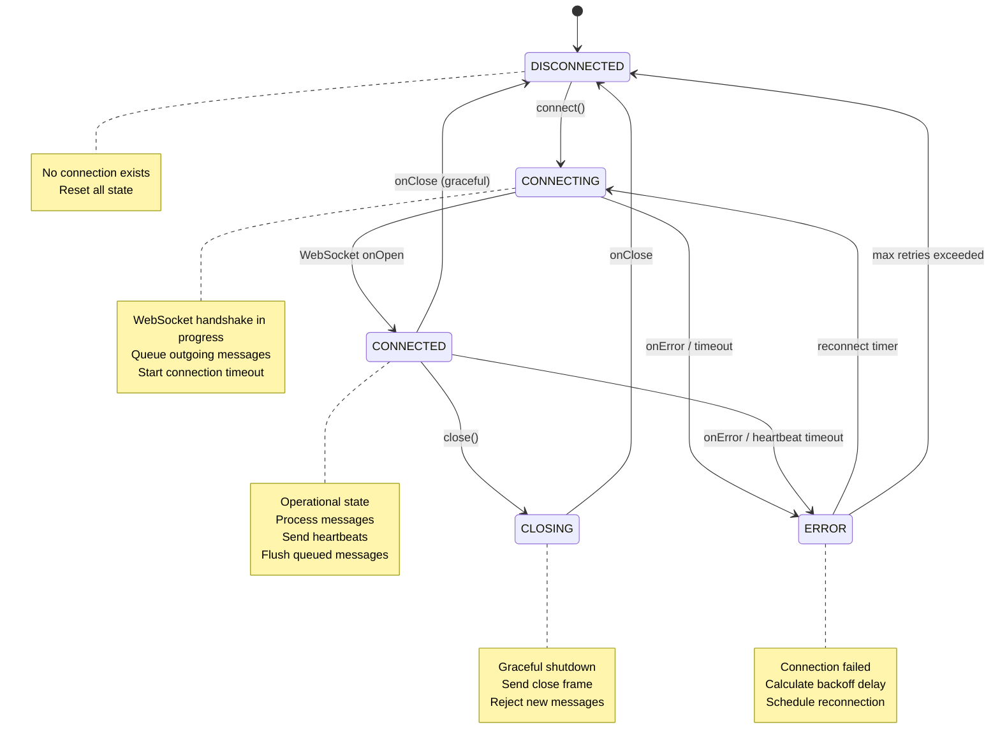
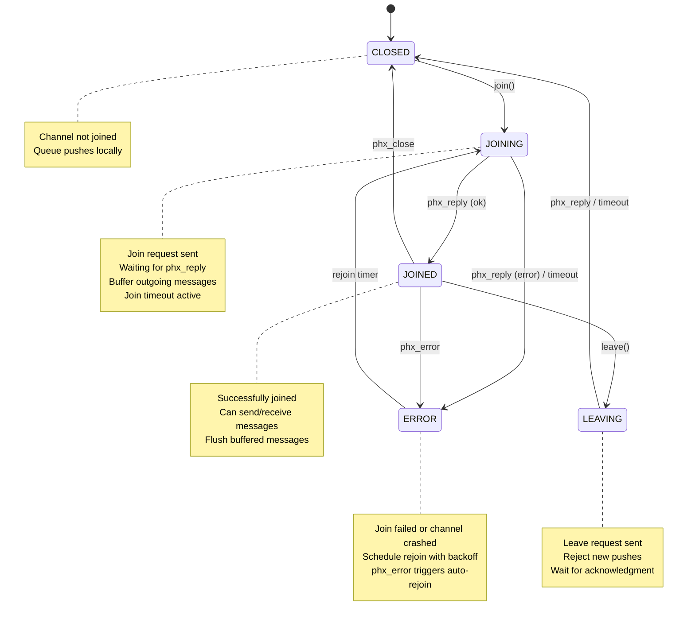
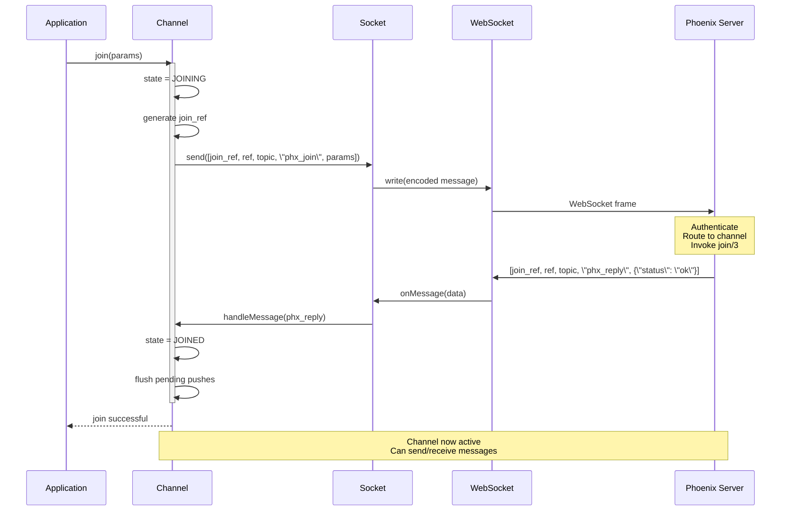
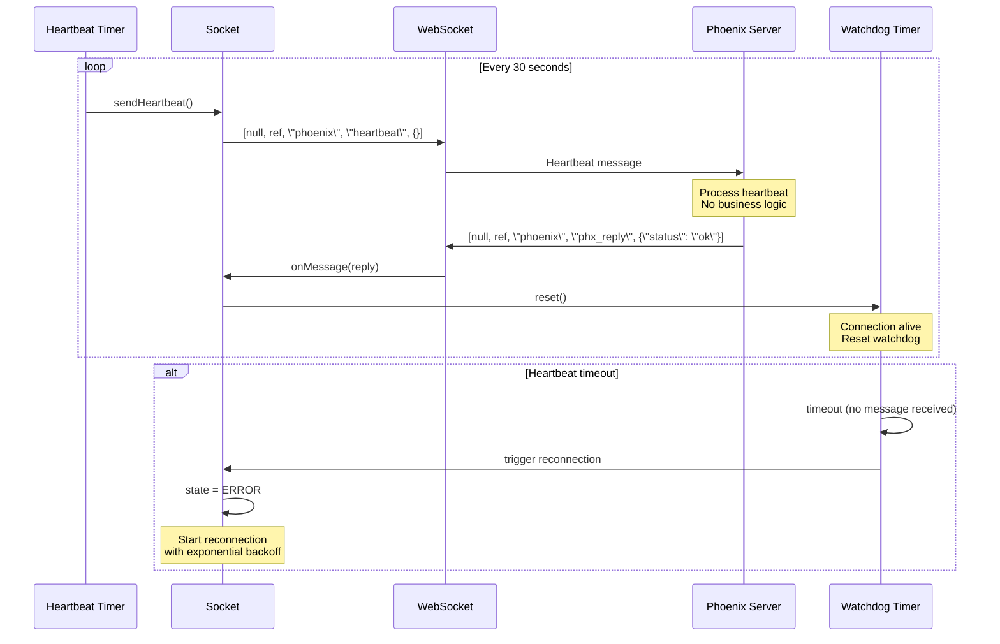
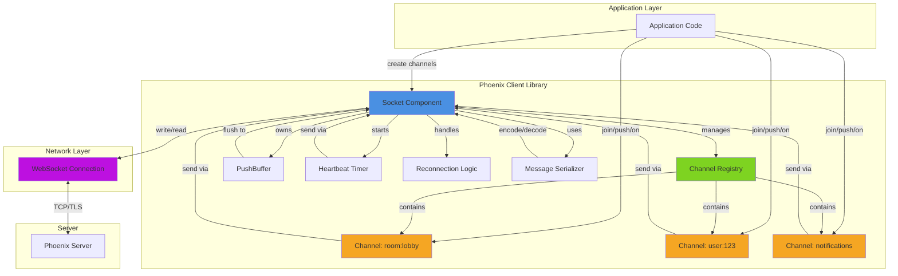
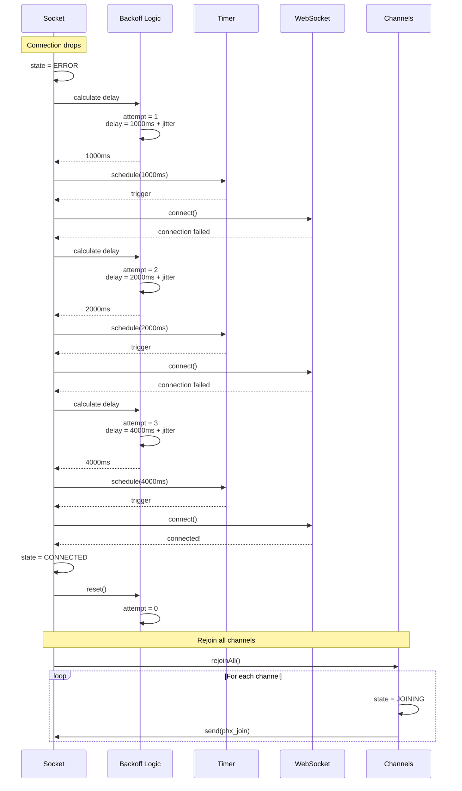

# Implementing Phoenix Channels in Zig: A Comprehensive Guide

This guide provides everything you need to implement a Phoenix Channels client library in Zig, from protocol specifications to production-ready code patterns.

## Table of Contents

1. [Phoenix Channels Protocol Deep Dive](#1-phoenix-channels-protocol-deep-dive)
2. [Architecture and Components](#2-architecture-and-components)
3. [Zig-Specific Implementation Guidance](#3-zig-specific-implementation-guidance)
4. [Code Examples](#4-code-examples)
5. [Visual Documentation](#5-visual-documentation)

---

## 1. Phoenix Channels Protocol Deep Dive

### 1.1 Message Format Specification

Phoenix Channels uses the **V2 JSON Serializer** format, transmitting messages as JSON arrays with exactly 5 elements:

```json
[join_reference, message_reference, topic_name, event_name, payload]
```

**Field Descriptions:**

- **join_reference** (string | null): Unique identifier for the channel join, required for `phx_join` events, null for other messages
- **message_reference** (string): Unique client-generated ID for matching requests with replies  
- **topic_name** (string): Channel topic identifier (e.g., "room:lobby", "user:123")
- **event_name** (string): Event type being sent/received
- **payload** (JSON object): Must be a JSON object (not primitive), contains event data

**Example Messages:**

```json
// Join channel
["0", "0", "room:lobby", "phx_join", {"token": "xyz"}]

// Leave channel  
[null, "1", "room:lobby", "phx_leave", {}]

// Heartbeat
[null, "2", "phoenix", "heartbeat", {}]

// Custom event
[null, "3", "room:lobby", "new_message", {"body": "Hello!"}]

// Server reply (success)
["0", "0", "room:lobby", "phx_reply", {"status": "ok", "response": {...}}]

// Server reply (error)
["0", "1", "room:lobby", "phx_reply", {"status": "error", "response": {"reason": "unauthorized"}}]
```

### 1.2 Core Protocol Events

#### System Events

**phx_join** - Join/subscribe to a channel
- Direction: Client → Server
- Requires unique join_ref
- Server responds with phx_reply containing status "ok" or "error"
- On success, channel is subscribed and can send/receive messages

**phx_leave** - Leave/unsubscribe from channel
- Direction: Client → Server  
- Server responds with phx_reply, then phx_close
- Graceful channel shutdown

**phx_reply** - Server response to client requests
- Direction: Server → Client
- Payload structure: `{"status": "ok"|"error"|"timeout", "response": {...}}`
- Uses message_ref to match replies to requests

**phx_error** - Channel error notification
- Direction: Server → Client
- Indicates channel crash or error
- **Triggers automatic rejoin** with exponential backoff

**phx_close** - Channel closed notification
- Direction: Server → Client
- Graceful channel closure
- **Does NOT trigger automatic rejoin**

**heartbeat** - Keep connection alive
- Direction: Bidirectional (typically Client → Server)
- Uses special "phoenix" topic
- Default interval: 30 seconds
- Prevents connection timeout and detects broken connections

### 1.3 Connection Lifecycle

**Complete Connection Flow:**

1. **WebSocket Handshake**: Connect to `ws://host:port/socket_path/websocket?vsn=2.0.0`
2. **Socket Connection**: Establishes WebSocket, server authenticates via `connect/3`
3. **Channel Join**: Client sends phx_join message
4. **Server Routing**: Routes to channel module's `join/3` callback  
5. **Join Reply**: Server sends phx_reply with success/error status
6. **Active Channel**: On success, client can send/receive messages
7. **Heartbeat Loop**: Client sends heartbeat every 30s
8. **Graceful Shutdown**: Client sends phx_leave, receives phx_reply + phx_close

### 1.4 Error Handling Patterns

**Error Response Types:**

- **Join Errors**: phx_reply with status "error" - channel not joined, can retry
- **Channel Crash**: phx_error event - automatic rejoin with exponential backoff
- **Transport Failure**: WebSocket drops - automatic reconnection
- **Push Timeout**: No reply within timeout (default 10s) - timeout callback triggered
- **Graceful Close**: phx_close event - NO automatic rejoin

**Common Error Reasons:**
- "unauthorized" - Failed authorization
- "join crashed" - Exception during join
- "timeout" - Operation timeout
- "unmatched topic" - Topic not found

### 1.5 Reconnection Strategy

**Exponential Backoff (Phoenix.js default):**
```javascript
function(tries) {
  return [1000, 5000, 10000][tries - 1] || 10000
}
```

**Timing:**
- 1st attempt: 1000ms (1 second)
- 2nd attempt: 5000ms (5 seconds)
- 3rd+ attempts: 10000ms (10 seconds)

**Reconnection Flow:**
1. Connection drops/error detected
2. Timer schedules reconnection with backoff delay
3. Attempt WebSocket reconnection
4. On success: rejoin all previously subscribed channels
5. On failure: retry with next backoff delay
6. Reset backoff counter on successful reconnection

**Client Message Buffering:**
- Client queues outgoing messages when disconnected
- Messages held in memory until connection established
- Sent automatically upon reconnection
- Default timeout: 5000ms per message
- No persistent storage (lost if process terminates)

### 1.6 Presence Handling

Phoenix Presence provides distributed user tracking with **CRDT-based conflict resolution**.

**Core Operations:**
- `Presence.track()` - Track user presence
- `Presence.list()` - List all present users
- `syncState()` - Full state synchronization
- `syncDiff()` - Incremental diff updates

**Message Events:**
- `presence_state` - Full presence state
- `presence_diff` - Incremental updates

**State Structure:**
```json
{
  "user_id": {
    "metas": [
      {"phx_ref": "ref1", "online_at": 1234567890}
    ]
  }
}
```

**Diff Format:**
```json
{
  "joins": {"user_id": {...}},
  "leaves": {"user_id": {...}}
}
```

### 1.7 Channel Multiplexing

**Single WebSocket Architecture:**
- One WebSocket connection per client
- Multiple channels multiplexed over same connection
- Topics distinguish channels: "room:1", "room:2", "user:123"
- Each channel is isolated server-side (separate Erlang process)

**Message Routing:**
- Messages routed by topic to correct channel
- join_ref tracks which channel instance
- Can handle millions of channels per server node

**Important:** Client may only hold ONE subscription per unique topic. Attempting duplicate join causes server to close existing channel and spawn new one.

### 1.8 Protocol Quirks and Gotchas

1. **Join Reference Persistence**: join_ref required for phx_join only; use null for regular messages
2. **Payload Must Be Object**: Cannot send primitives directly; must wrap in object
3. **Ref Uniqueness**: Refs only need uniqueness per socket; string format recommended
4. **Heartbeat Topic**: Use "phoenix" topic for heartbeat; don't need to join it
5. **Leave vs Close vs Error**: Only phx_error triggers automatic recovery; phx_close does not
6. **Message Ordering**: No guaranteed ordering across channels, but ordered within single channel
7. **Rejoin Parameters**: Subsequent rejoins use current channel.params, allowing dynamic authorization updates
8. **Channel Process Lifecycle**: Each channel is a GenServer process; crash isolated from socket

---

## 2. Architecture and Components

### 2.1 Component Overview

A production-ready Phoenix Channels client requires these core components:

#### **Socket Component**
- Manages WebSocket connection lifecycle
- Handles connection state machine (DISCONNECTED, CONNECTING, CONNECTED, CLOSING, ERROR)
- Manages heartbeat mechanism
- Maintains channel registry
- Handles message routing

#### **Channel Component**  
- Represents a logical channel on a topic
- Manages channel state machine (CLOSED, JOINING, JOINED, LEAVING, ERROR)
- Buffers messages when not joined
- Handles event callbacks
- Manages join references

#### **Message Component**
- Encapsulates the 5-field message structure
- Handles serialization/deserialization
- Validates message format

#### **Push Component**
- Manages outbound message delivery
- Handles receive callbacks (ok, error, timeout)
- Tracks message references
- Implements timeout logic

#### **PushBuffer Component**
- Queues messages when connection unavailable
- FIFO ordering
- Size-limited with overflow handling
- Flushed on connection/join

#### **Timer Component**
- Manages heartbeat intervals
- Handles reconnection backoff
- Push timeouts
- Join timeouts

#### **Serializer Component**
- JSON encoding/decoding by default
- Pluggable for alternative formats (MessagePack, etc.)

### 2.2 Connection State Machine

**States:**
- **DISCONNECTED**: No connection exists
- **CONNECTING**: Connection attempt in progress
- **CONNECTED**: WebSocket established, operational
- **CLOSING**: Graceful close initiated
- **ERROR**: Connection error, will trigger reconnection

**Key Transitions:**
```
DISCONNECTED --[connect()]---> CONNECTING
CONNECTING --[onOpen]---> CONNECTED
CONNECTING --[onError/timeout]---> ERROR
CONNECTED --[onClose]---> DISCONNECTED
CONNECTED --[onError]---> ERROR
CONNECTED --[close()]---> CLOSING
CLOSING --[onClose]---> DISCONNECTED
ERROR --[reconnect_timer]---> CONNECTING
```

**State Behaviors:**
- **DISCONNECTED**: Clear all state, no operations allowed
- **CONNECTING**: Queue outgoing messages, start connection timeout
- **CONNECTED**: Process messages, send queued messages, run heartbeat
- **CLOSING**: Reject new messages, send close frame
- **ERROR**: Calculate backoff, schedule reconnection

### 2.3 Channel State Machine

**States:**
- **CLOSED**: Channel not joined
- **JOINING**: Join request sent, awaiting reply
- **JOINED**: Successfully joined, operational
- **LEAVING**: Leave request sent
- **ERROR**: Join failed or channel error, will auto-rejoin

**Key Transitions:**
```
CLOSED --[join()]---> JOINING
JOINING --[phx_reply ok]---> JOINED
JOINING --[phx_reply error/timeout]---> ERROR
JOINED --[leave()]---> LEAVING
JOINED --[phx_error]---> ERROR  (auto-rejoin)
JOINED --[phx_close]---> CLOSED  (no auto-rejoin)
LEAVING --[phx_reply/timeout]---> CLOSED
ERROR --[rejoin_timer]---> JOINING
```

**State Behaviors:**
- **CLOSED**: Clear channel state, optionally queue pushes
- **JOINING**: Send phx_join, buffer outgoing messages, start timeout
- **JOINED**: Flush buffered messages, process events, accept pushes
- **LEAVING**: Send phx_leave, reject new pushes
- **ERROR**: Schedule rejoin with exponential backoff

### 2.4 Message Flow Architecture

**Outbound Message Flow:**
```
Application → Channel.push()
    ↓
Channel State Check
    ↓ (if JOINED)
Socket.send()
    ↓
Socket State Check  
    ↓ (if CONNECTED)
Serialize Message
    ↓
WebSocket.send()
```

**If not ready:** Message → PushBuffer → Flushed when ready

**Inbound Message Flow:**
```
WebSocket.onMessage()
    ↓
Deserialize Message
    ↓
Route by Topic
    ↓ (if "phoenix")
Handle System Message (heartbeat)
    ↓ (if phx_reply)
Match by Ref → Trigger Callback
    ↓ (if regular event)
Channel.trigger()
    ↓
Application Event Handler
```

### 2.5 Heartbeat Mechanism

**Architecture:**
- Separate timer, not main event loop
- Client sends, server echoes
- Default interval: 30 seconds
- Watchdog timer detects missed responses

**Heartbeat Flow:**
```
[Timer] → Socket.sendHeartbeat()
          ↓
[Socket] → WebSocket.send([null, ref, "phoenix", "heartbeat", {}])
          ↓
[Server] → phx_reply {"status": "ok"}
          ↓
[Socket] → Reset watchdog timer
```

**Timeout Detection:**
- Watchdog timer resets on ANY message (not just heartbeat)
- If no message within timeout (e.g., 2x interval), assume connection dead
- Trigger reconnection

### 2.6 Message Queuing Strategy

**Two-Level Queuing:**

1. **Socket-level PushBuffer**: Stores messages when socket not connected
2. **Channel-level Buffer**: Stores messages when channel not joined

**Queue Behavior:**
- FIFO ordering preserved
- Size-limited (configurable: socket 1000, channel 100)
- Overflow: drop oldest (default) or drop newest

**Flushing:**
- Socket buffer flushed on CONNECTED state
- Channel buffer flushed on JOINED state
- Preserves message ordering

**At-Most-Once Delivery:**
- Phoenix does NOT guarantee message delivery
- Messages may be lost if connection drops before ACK
- Implement application-level reliability if needed:
  - Track last_seen_id
  - Request catch-up on reconnect
  - Use idempotent message design

### 2.7 Multiplexing Implementation

**Channel Registry:**
```
Socket {
  channels: HashMap<topic_string, Channel>
}
```

**Message Routing Logic:**
1. Receive message from WebSocket
2. Extract topic field
3. If topic == "phoenix": handle system message
4. Else: lookup channel in registry
5. If found: channel.handleMessage()
6. If not found: log and discard

**Benefits:**
- One TCP connection for all channels
- Lower latency (no per-channel handshake)
- Reduced resource usage
- Simplified reconnection logic

**Challenge:** Head-of-line blocking - large message on one channel delays others. Mitigate with message fragmentation and prioritization.

---

## 3. Zig-Specific Implementation Guidance

### 3.1 Critical: Async/Await Status

**Zig 0.11.0 removed async/await** - it's being redesigned for a future release (expected 0.13.0+).

**Current Concurrency Options:**
1. **OS Threads (std.Thread)** - Most common, recommended for Phoenix Channels
2. **Event Loops (libxev/xev)** - For async-style I/O
3. **Thread Pools (std.Thread.Pool)** - For work distribution

For Phoenix Channels, **thread-based concurrency works well** and is the practical choice today.

### 3.2 WebSocket Library Recommendation

**Use: karlseguin/websocket.zig**

**Rationale:**
- Most mature and battle-tested
- Active maintenance (follows Zig master)
- Comprehensive features (TLS, compression, testing)
- Good documentation and examples
- Thread-based concurrency model fits Phoenix well
- Autobahn test suite compliant

**Alternative:** async_zocket if you need single-threaded async I/O with libxev event loop.

### 3.3 Memory Management Strategy

**For Long-Running Clients:**

1. **GeneralPurposeAllocator (GPA)** as base:
```zig
var gpa = std.heap.GeneralPurposeAllocator(.{}){}; 
defer {
    const leaked = gpa.deinit();
    if (leaked == .leak) std.debug.print("Memory leak!\n", .{});
}
const allocator = gpa.allocator();
```

2. **ArenaAllocator** for message processing:
```zig
fn handleMessage(base_allocator: std.mem.Allocator, data: []const u8) !void {
    var arena = std.heap.ArenaAllocator.init(base_allocator);
    defer arena.deinit(); // Frees all at once
    
    const temp = arena.allocator();
    // Parse JSON, create temporary structures
    const parsed = try std.json.parseFromSlice(PhoenixMessage, temp, data, .{});
    // All allocations freed by arena.deinit()
}
```

3. **FixedBufferAllocator** for hot paths:
```zig
var buffer: [4096]u8 = undefined;
var fba = std.heap.FixedBufferAllocator.init(&buffer);
const allocator = fba.allocator();
// No heap allocations
```

**Best Practice Pattern:**
- GPA as base allocator for the socket/client struct
- Arena for each message processing cycle (reset after processing)
- Fixed buffers for heartbeats and small, predictable messages
- Pre-allocate buffers for common message sizes

### 3.4 Error Handling with Error Unions

Zig's error handling is explicit and composable:

**Define Comprehensive Error Sets:**
```zig
const PhoenixError = error{
    // Connection errors
    ConnectionFailed,
    Disconnected,
    Timeout,
    // Protocol errors
    InvalidMessage,
    UnknownTopic,
    JoinFailed,
    // Resource errors
    OutOfMemory,
    BufferOverflow,
};
```

**Error Handling Patterns:**

**try** - Propagate errors:
```zig
pub fn connect(self: *Socket) !void {
    const conn = try self.ws.connect(); // Returns error if fails
}
```

**catch** - Handle locally:
```zig
const data = readFile("config.json") catch |err| switch(err) {
    error.NotFound => return error.ConfigMissing,
    error.PermissionDenied => return error.AccessDenied,
    else => return err,
};
```

**errdefer** - Cleanup on error (critical pattern):
```zig
fn createConnection(allocator: std.mem.Allocator) !*Connection {
    const conn = try allocator.create(Connection);
    errdefer allocator.destroy(conn); // Only runs on error
    
    try conn.init();
    errdefer conn.deinit(); // Cleanup if subsequent ops fail
    
    try conn.connect();
    return conn;
}
```

### 3.5 State Machine Implementation

**Enum-Based State Machine:**
```zig
const ConnectionState = enum {
    disconnected,
    connecting,
    connected,
    closing,
};

const Socket = struct {
    state: ConnectionState,
    
    pub fn connect(self: *Socket) !void {
        switch (self.state) {
            .disconnected => {
                self.state = .connecting;
                try self.doConnect();
                self.state = .connected;
            },
            .connected => return error.AlreadyConnected,
            else => return error.InvalidState,
        }
    }
};
```

**Event-Driven State Machine:**
```zig
const ChannelState = enum { idle, joining, joined, leaving };
const Event = enum { join, join_ok, join_error, leave, leave_ok };

const Channel = struct {
    state: ChannelState,
    
    pub fn handleEvent(self: *Channel, event: Event) !void {
        switch (self.state) {
            .idle => switch (event) {
                .join => {
                    self.state = .joining;
                    try self.sendJoin();
                },
                else => return error.InvalidTransition,
            },
            .joining => switch (event) {
                .join_ok => self.state = .joined,
                .join_error => self.state = .idle,
                else => return error.InvalidTransition,
            },
            .joined => switch (event) {
                .leave => {
                    self.state = .leaving;
                    try self.sendLeave();
                },
                else => {},
            },
            .leaving => switch (event) {
                .leave_ok => self.state = .idle,
                else => {},
            },
        }
    }
};
```

### 3.6 JSON Handling

**Parsing JSON into Structs:**
```zig
const PhoenixMessage = struct {
    topic: []const u8,
    event: []const u8,
    payload: std.json.Value,
    ref: ?[]const u8,
};

pub fn parseMessage(allocator: std.mem.Allocator, json_str: []const u8) !std.json.Parsed(PhoenixMessage) {
    return try std.json.parseFromSlice(
        PhoenixMessage,
        allocator,
        json_str,
        .{ .allocate = .alloc_always }
    );
}

// Usage:
const parsed = try parseMessage(allocator, data);
defer parsed.deinit(); // Always deinit!
const message = parsed.value;
```

**Serializing to JSON:**
```zig
fn serializeMessage(allocator: std.mem.Allocator, msg: PhoenixMessage) ![]u8 {
    var list = std.ArrayList(u8).init(allocator);
    errdefer list.deinit();
    
    try std.json.stringify(msg, .{}, list.writer());
    return list.toOwnedSlice();
}
```

### 3.7 Thread Safety Patterns

**Mutex Protection:**
```zig
const SharedState = struct {
    mutex: std.Thread.Mutex,
    data: []u8,
    
    pub fn update(self: *SharedState, new_data: []const u8) void {
        self.mutex.lock();
        defer self.mutex.unlock();
        
        @memcpy(self.data[0..new_data.len], new_data);
    }
};
```

**Thread Spawning:**
```zig
const thread = try std.Thread.spawn(.{}, workerFunction, .{allocator});
thread.detach(); // or thread.join() to wait
```

---

## 4. Code Examples

### 4.1 Complete Phoenix Socket Implementation

```zig
const std = @import(\"std\");
const ws = @import(\"websocket\");

// Message representation matching Phoenix format
pub const PhoenixMessage = struct {
    join_ref: ?[]const u8,
    ref: ?[]const u8,
    topic: []const u8,
    event: []const u8,
    payload: std.json.Value,
    
    pub fn toArray(self: PhoenixMessage, allocator: std.mem.Allocator) ![]u8 {
        // Serialize as 5-element array
        const array = .{
            self.join_ref,
            self.ref,
            self.topic,
            self.event,
            self.payload,
        };
        
        var list = std.ArrayList(u8).init(allocator);
        errdefer list.deinit();
        
        try std.json.stringify(array, .{}, list.writer());
        return list.toOwnedSlice();
    }
    
    pub fn fromArray(allocator: std.mem.Allocator, data: []const u8) !std.json.Parsed(PhoenixMessage) {
        // Parse 5-element array
        const ArrayFormat = struct {
            ?[]const u8, // join_ref
            ?[]const u8, // ref
            []const u8,  // topic
            []const u8,  // event
            std.json.Value, // payload
        };
        
        const parsed = try std.json.parseFromSlice(ArrayFormat, allocator, data, .{});
        defer parsed.deinit();
        
        const arr = parsed.value;
        const msg = PhoenixMessage{
            .join_ref = arr[0],
            .ref = arr[1],
            .topic = arr[2],
            .event = arr[3],
            .payload = arr[4],
        };
        
        // Return owned version
        return std.json.Parsed(PhoenixMessage){
            .arena = parsed.arena,
            .value = msg,
        };
    }
};

// Connection state
pub const ConnectionState = enum {
    disconnected,
    connecting,
    connected,
    closing,
    error_state,
};

// Main Socket component
pub const PhoenixSocket = struct {
    allocator: std.mem.Allocator,
    client: *ws.Client,
    channels: std.StringHashMap(*Channel),
    state: ConnectionState,
    ref_counter: u64,
    mutex: std.Thread.Mutex,
    heartbeat_thread: ?std.Thread,
    
    pub fn init(allocator: std.mem.Allocator, host: []const u8, port: u16) !PhoenixSocket {
        const client = try allocator.create(ws.Client);
        errdefer allocator.destroy(client);
        
        client.* = try ws.Client.init(allocator, .{
            .host = host,
            .port = port,
        });
        
        var channels = std.StringHashMap(*Channel).init(allocator);
        
        return PhoenixSocket{
            .allocator = allocator,
            .client = client,
            .channels = channels,
            .state = .disconnected,
            .ref_counter = 0,
            .mutex = std.Thread.Mutex{},
            .heartbeat_thread = null,
        };
    }
    
    pub fn deinit(self: *PhoenixSocket) void {
        // Stop heartbeat thread
        if (self.heartbeat_thread) |thread| {
            // Signal thread to stop (implementation-specific)
            thread.detach();
        }
        
        // Clean up channels
        var iter = self.channels.valueIterator();
        while (iter.next()) |channel| {
            channel.*.deinit();
            self.allocator.destroy(channel.*);
        }
        self.channels.deinit();
        
        // Clean up client
        self.client.deinit();
        self.allocator.destroy(self.client);
    }
    
    pub fn connect(self: *PhoenixSocket, path: []const u8) !void {
        self.mutex.lock();
        defer self.mutex.unlock();
        
        if (self.state != .disconnected) {
            return error.InvalidState;
        }
        
        self.state = .connecting;
        
        // Perform WebSocket handshake
        try self.client.handshake(path, .{
            .timeout_ms = 5000,
        });
        
        self.state = .connected;
        
        // Start heartbeat
        self.heartbeat_thread = try std.Thread.spawn(
            .{},
            heartbeatLoop,
            .{self}
        );
        
        // Start message handler
        const msg_thread = try self.client.readLoopInNewThread(self);
        msg_thread.detach();
    }
    
    pub fn disconnect(self: *PhoenixSocket) void {
        self.mutex.lock();
        defer self.mutex.unlock();
        
        if (self.state == .connected) {
            self.state = .closing;
            self.client.close(.{}) catch {};
            self.state = .disconnected;
        }
    }
    
    pub fn channel(self: *PhoenixSocket, topic: []const u8) !*Channel {
        self.mutex.lock();
        defer self.mutex.unlock();
        
        // Check if channel exists
        if (self.channels.get(topic)) |ch| {
            return ch;
        }
        
        // Create new channel
        const ch = try self.allocator.create(Channel);
        errdefer self.allocator.destroy(ch);
        
        ch.* = try Channel.init(self.allocator, self, topic);
        errdefer ch.deinit();
        
        try self.channels.put(topic, ch);
        return ch;
    }
    
    pub fn makeRef(self: *PhoenixSocket) []const u8 {
        self.mutex.lock();
        defer self.mutex.unlock();
        
        self.ref_counter += 1;
        // Convert to string (simplified - should allocate properly)
        return std.fmt.allocPrint(
            self.allocator,
            \"{}\",
            .{self.ref_counter}
        ) catch unreachable;
    }
    
    pub fn send(self: *PhoenixSocket, msg: PhoenixMessage) !void {
        if (self.state != .connected) {
            return error.NotConnected;
        }
        
        const json = try msg.toArray(self.allocator);
        defer self.allocator.free(json);
        
        // WebSocket requires mutable buffer for masking
        var mutable = try self.allocator.dupe(u8, json);
        defer self.allocator.free(mutable);
        
        try self.client.write(mutable);
    }
    
    // Called by readLoopInNewThread for incoming messages
    pub fn serverMessage(self: *PhoenixSocket, data: []u8) !void {
        // Use arena for temporary allocations
        var arena = std.heap.ArenaAllocator.init(self.allocator);
        defer arena.deinit();
        const temp = arena.allocator();
        
        // Parse message
        const parsed = try PhoenixMessage.fromArray(temp, data);
        defer parsed.deinit();
        
        const msg = parsed.value;
        
        // Route to appropriate handler
        if (std.mem.eql(u8, msg.topic, \"phoenix\")) {
            // System message (heartbeat response)
            if (std.mem.eql(u8, msg.event, \"phx_reply\")) {
                // Heartbeat ACK - nothing to do
            }
        } else {
            // Route to channel
            self.mutex.lock();
            defer self.mutex.unlock();
            
            if (self.channels.get(msg.topic)) |channel| {
                try channel.handleMessage(msg);
            }
        }
    }
    
    fn heartbeatLoop(self: *PhoenixSocket) void {
        while (self.state == .connected) {
            // Send heartbeat
            const msg = PhoenixMessage{
                .join_ref = null,
                .ref = self.makeRef(),
                .topic = \"phoenix\",
                .event = \"heartbeat\",
                .payload = .{ .object = std.json.ObjectMap.init(self.allocator) },
            };
            
            self.send(msg) catch |err| {
                std.debug.print(\"Heartbeat send failed: {}\\n\", .{err});
                // Trigger reconnection
                self.state = .error_state;
                return;
            };
            
            // Wait 30 seconds
            std.time.sleep(30 * std.time.ns_per_s);
        }
    }
};
```

### 4.2 Channel Implementation

```zig
pub const ChannelState = enum {
    closed,
    joining,
    joined,
    leaving,
    error_state,
};

pub const Channel = struct {
    allocator: std.mem.Allocator,
    socket: *PhoenixSocket,
    topic: []const u8,
    state: ChannelState,
    join_ref: ?[]const u8,
    callbacks: std.StringHashMap(CallbackFn),
    pending_pushes: std.ArrayList(PhoenixMessage),
    mutex: std.Thread.Mutex,
    
    pub const CallbackFn = *const fn (payload: std.json.Value) void;
    
    pub fn init(allocator: std.mem.Allocator, socket: *PhoenixSocket, topic: []const u8) !Channel {
        return Channel{
            .allocator = allocator,
            .socket = socket,
            .topic = try allocator.dupe(u8, topic),
            .state = .closed,
            .join_ref = null,
            .callbacks = std.StringHashMap(CallbackFn).init(allocator),
            .pending_pushes = std.ArrayList(PhoenixMessage).init(allocator),
            .mutex = std.Thread.Mutex{},
        };
    }
    
    pub fn deinit(self: *Channel) void {
        self.allocator.free(self.topic);
        if (self.join_ref) |ref| {
            self.allocator.free(ref);
        }
        self.callbacks.deinit();
        self.pending_pushes.deinit();
    }
    
    pub fn join(self: *Channel, params: std.json.Value) !void {
        self.mutex.lock();
        defer self.mutex.unlock();
        
        if (self.state != .closed) {
            return error.InvalidState;
        }
        
        self.state = .joining;
        
        // Generate join ref
        self.join_ref = self.socket.makeRef();
        
        // Create join message
        const msg = PhoenixMessage{
            .join_ref = self.join_ref,
            .ref = self.socket.makeRef(),
            .topic = self.topic,
            .event = \"phx_join\",
            .payload = params,
        };
        
        // Send join
        try self.socket.send(msg);
        
        // TODO: Start join timeout
    }
    
    pub fn leave(self: *Channel) !void {
        self.mutex.lock();
        defer self.mutex.unlock();
        
        if (self.state != .joined) {
            return error.NotJoined;
        }
        
        self.state = .leaving;
        
        const msg = PhoenixMessage{
            .join_ref = null,
            .ref = self.socket.makeRef(),
            .topic = self.topic,
            .event = \"phx_leave\",
            .payload = .{ .object = std.json.ObjectMap.init(self.allocator) },
        };
        
        try self.socket.send(msg);
    }
    
    pub fn push(self: *Channel, event: []const u8, payload: std.json.Value) !void {
        self.mutex.lock();
        defer self.mutex.unlock();
        
        const msg = PhoenixMessage{
            .join_ref = null,
            .ref = self.socket.makeRef(),
            .topic = self.topic,
            .event = event,
            .payload = payload,
        };
        
        if (self.state == .joined) {
            // Send immediately
            try self.socket.send(msg);
        } else {
            // Buffer for later
            try self.pending_pushes.append(msg);
        }
    }
    
    pub fn on(self: *Channel, event: []const u8, callback: CallbackFn) !void {
        try self.callbacks.put(event, callback);
    }
    
    pub fn handleMessage(self: *Channel, msg: PhoenixMessage) !void {
        self.mutex.lock();
        defer self.mutex.unlock();
        
        // Handle phx_reply
        if (std.mem.eql(u8, msg.event, \"phx_reply\")) {
            const status = msg.payload.object.get(\"status\").?.string;
            
            if (std.mem.eql(u8, status, \"ok\") and self.state == .joining) {
                // Join successful
                self.state = .joined;
                
                // Flush pending pushes
                for (self.pending_pushes.items) |pending| {
                    try self.socket.send(pending);
                }
                self.pending_pushes.clearRetainingCapacity();
            } else if (std.mem.eql(u8, status, \"error\")) {
                // Join failed
                self.state = .error_state;
                // TODO: Schedule rejoin with backoff
            }
        }
        // Handle phx_error
        else if (std.mem.eql(u8, msg.event, \"phx_error\")) {
            self.state = .error_state;
            // TODO: Auto-rejoin with backoff
        }
        // Handle phx_close  
        else if (std.mem.eql(u8, msg.event, \"phx_close\")) {
            self.state = .closed;
            // No auto-rejoin
        }
        // Handle custom events
        else {
            if (self.callbacks.get(msg.event)) |callback| {
                callback(msg.payload);
            }
        }
    }
};
```

### 4.3 Message Encoding/Decoding Example

```zig
const std = @import(\"std\");

pub fn encodePhoenixMessage(
    allocator: std.mem.Allocator,
    join_ref: ?[]const u8,
    ref: ?[]const u8,
    topic: []const u8,
    event: []const u8,
    payload: std.json.Value,
) ![]u8 {
    // Create tuple/array structure
    const message_array = .{ join_ref, ref, topic, event, payload };
    
    var buffer = std.ArrayList(u8).init(allocator);
    errdefer buffer.deinit();
    
    try std.json.stringify(message_array, .{}, buffer.writer());
    
    return buffer.toOwnedSlice();
}

pub fn decodePhoenixMessage(
    allocator: std.mem.Allocator,
    json_data: []const u8,
) !PhoenixMessage {
    // Define the expected array structure
    const MessageArray = struct {
        ?[]const u8, // join_ref
        ?[]const u8, // ref
        []const u8,  // topic
        []const u8,  // event
        std.json.Value, // payload
    };
    
    const parsed = try std.json.parseFromSlice(
        MessageArray,
        allocator,
        json_data,
        .{ .allocate = .alloc_always }
    );
    defer parsed.deinit();
    
    const arr = parsed.value;
    
    return PhoenixMessage{
        .join_ref = if (arr[0]) |r| try allocator.dupe(u8, r) else null,
        .ref = if (arr[1]) |r| try allocator.dupe(u8, r) else null,
        .topic = try allocator.dupe(u8, arr[2]),
        .event = try allocator.dupe(u8, arr[3]),
        .payload = arr[4],
    };
}

// Example usage
pub fn exampleUsage() !void {
    var gpa = std.heap.GeneralPurposeAllocator(.{}){};
    const allocator = gpa.allocator();
    
    // Encode a join message
    var payload_obj = std.json.ObjectMap.init(allocator);
    try payload_obj.put(\"token\", .{ .string = \"abc123\" });
    
    const encoded = try encodePhoenixMessage(
        allocator,
        \"0\",           // join_ref
        \"0\",           // ref
        \"room:lobby\",  // topic
        \"phx_join\",    // event
        .{ .object = payload_obj }, // payload
    );
    defer allocator.free(encoded);
    
    std.debug.print(\"Encoded: {s}\\n\", .{encoded});
    // Output: [\"0\",\"0\",\"room:lobby\",\"phx_join\",{\"token\":\"abc123\"}]
    
    // Decode it back
    const decoded = try decodePhoenixMessage(allocator, encoded);
    std.debug.print(\"Topic: {s}, Event: {s}\\n\", .{decoded.topic, decoded.event});
}
```

### 4.4 Reconnection with Exponential Backoff

```zig
const std = @import(\"std\");

pub const ReconnectionBackoff = struct {
    initial_delay_ms: u64,
    max_delay_ms: u64,
    multiplier: f64,
    jitter_factor: f64,
    attempt: u32,
    max_attempts: u32,
    
    pub fn init() ReconnectionBackoff {
        return .{
            .initial_delay_ms = 1000,
            .max_delay_ms = 30000,
            .multiplier = 2.0,
            .jitter_factor = 0.2,
            .attempt = 0,
            .max_attempts = std.math.maxInt(u32),
        };
    }
    
    pub fn nextDelay(self: *ReconnectionBackoff) ?u64 {
        if (self.attempt >= self.max_attempts) {
            return null; // Stop retrying
        }
        
        // Calculate base delay
        const power = std.math.pow(f64, self.multiplier, @floatFromInt(self.attempt));
        const base_delay_f = @as(f64, @floatFromInt(self.initial_delay_ms)) * power;
        const base_delay = @min(
            @as(u64, @intFromFloat(base_delay_f)),
            self.max_delay_ms
        );
        
        // Add jitter
        var prng = std.rand.DefaultPrng.init(@intCast(std.time.milliTimestamp()));
        const random = prng.random();
        const jitter_range = @as(f64, @floatFromInt(base_delay)) * self.jitter_factor;
        const jitter = random.float(f64) * jitter_range;
        
        const final_delay = base_delay + @as(u64, @intFromFloat(jitter));
        
        self.attempt += 1;
        return final_delay;
    }
    
    pub fn reset(self: *ReconnectionBackoff) void {
        self.attempt = 0;
    }
};

// Example usage in reconnection loop
pub fn reconnectionExample(socket: *PhoenixSocket) !void {
    var backoff = ReconnectionBackoff.init();
    
    while (true) {
        // Attempt connection
        socket.connect(\"/socket/websocket\") catch |err| {
            std.debug.print(\"Connection failed: {}\\n\", .{err});
            
            // Calculate next delay
            if (backoff.nextDelay()) |delay_ms| {
                std.debug.print(\"Retrying in {}ms...\\n\", .{delay_ms});
                std.time.sleep(delay_ms * std.time.ns_per_ms);
                continue;
            } else {
                std.debug.print(\"Max retries exceeded\\n\", .{});
                return error.MaxRetriesExceeded;
            }
        };
        
        // Connection successful
        std.debug.print(\"Connected!\\n\", .{});
        backoff.reset();
        break;
    }
}
```

### 4.5 Complete Usage Example

```zig
const std = @import(\"std\");
const PhoenixSocket = @import(\"phoenix\").PhoenixSocket;

pub fn main() !void {
    var gpa = std.heap.GeneralPurposeAllocator(.{}){};
    defer _ = gpa.deinit();
    const allocator = gpa.allocator();
    
    // Create socket
    var socket = try PhoenixSocket.init(allocator, \"localhost\", 4000);
    defer socket.deinit();
    
    // Connect
    try socket.connect(\"/socket/websocket?vsn=2.0.0\");
    defer socket.disconnect();
    
    std.debug.print(\"Connected to Phoenix server\\n\", .{});
    
    // Create and join channel
    const channel = try socket.channel(\"room:lobby\");
    
    // Set up event handlers
    try channel.on(\"new_message\", handleNewMessage);
    try channel.on(\"user_joined\", handleUserJoined);
    
    // Join channel with params
    var params = std.json.ObjectMap.init(allocator);
    try params.put(\"user_id\", .{ .string = \"user123\" });
    
    try channel.join(.{ .object = params });
    
    std.debug.print(\"Joined channel: {s}\\n\", .{channel.topic});
    
    // Send a message
    var msg_payload = std.json.ObjectMap.init(allocator);
    try msg_payload.put(\"body\", .{ .string = \"Hello from Zig!\" });
    
    try channel.push(\"new_message\", .{ .object = msg_payload });
    
    // Keep alive
    std.time.sleep(60 * std.time.ns_per_s);
    
    // Leave channel
    try channel.leave();
}

fn handleNewMessage(payload: std.json.Value) void {
    if (payload.object.get(\"body\")) |body| {
        std.debug.print(\"New message: {s}\\n\", .{body.string});
    }
}

fn handleUserJoined(payload: std.json.Value) void {
    if (payload.object.get(\"user_id\")) |user_id| {
        std.debug.print(\"User joined: {s}\\n\", .{user_id.string});
    }
}
```

---

## 5. Visual Documentation

### 5.1 Connection Lifecycle State Machine



### 5.2 Channel Lifecycle State Machine



### 5.3 Message Flow for Joining a Channel



### 5.4 Heartbeat Sequence



### 5.5 Overall Architecture



### 5.6 Reconnection Flow with Exponential Backoff



### 5.7 Message Routing and Multiplexing

```mermaid
flowchart TD
    Start([WebSocket Message Received]) --> Deserialize[Deserialize JSON Array]
    Deserialize --> Extract[Extract topic field]
    
    Extract --> IsPhoenix{topic == \"phoenix\"?}
    
    IsPhoenix -->|Yes| SystemMsg[Handle System Message]
    SystemMsg --> IsHeartbeat{event == \"heartbeat\"?}
    IsHeartbeat -->|Yes| ResetWD[Reset Watchdog Timer]
    IsHeartbeat -->|No| OtherSys[Other System Event]
    
    IsPhoenix -->|No| IsReply{event == \"phx_reply\"?}
    
    IsReply -->|Yes| MatchRef[Match by message_ref]
    MatchRef --> TriggerCB[Trigger Push Callback]
    TriggerCB --> End([Done])
    
    IsReply -->|No| RouteChannel[Route to Channel by topic]
    RouteChannel --> ChannelExists{Channel exists?}
    
    ChannelExists -->|Yes| HandleChan[Channel.handleMessage]
    HandleChan --> IsPhxEvent{Is phx_* event?}
    
    IsPhxEvent -->|Yes| HandleProto[Handle Protocol Event<br/>phx_error/phx_close/etc]
    HandleProto --> UpdateState[Update Channel State]
    UpdateState --> End
    
    IsPhxEvent -->|No| CustomEvent[Custom Application Event]
    CustomEvent --> FindCallback[Find Registered Callback]
    FindCallback --> CallbackExists{Callback registered?}
    
    CallbackExists -->|Yes| InvokeApp[Invoke Application Handler]
    CallbackExists -->|No| LogUnhandled[Log Unhandled Event]
    
    ChannelExists -->|No| LogDrop[Log and Drop Message]
    
    ResetWD --> End
    OtherSys --> End
    InvokeApp --> End
    LogUnhandled --> End
    LogDrop --> End
```

---

## 6. Implementation Roadmap

### Phase 1: Core Foundation (Week 1-2)
1. Implement message serialization/deserialization
2. Create basic Socket component with state machine
3. Implement Channel component with state machine
4. Basic send/receive functionality
5. Unit tests for message encoding/decoding

### Phase 2: Reliability Features (Week 3-4)
1. Implement PushBuffer for message queuing
2. Add reconnection logic with exponential backoff
3. Implement heartbeat mechanism
4. Add join/leave timeout handling
5. Integration tests with test Phoenix server

### Phase 3: Multiplexing and Polish (Week 5-6)
1. Channel registry and routing
2. Multiple channel support
3. Comprehensive error handling
4. Logging and observability
5. Configuration options
6. Documentation and examples

### Phase 4: Advanced Features (Week 7-8)
1. Presence tracking support
2. Binary message support
3. Push receive hooks (ok, error, timeout)
4. Performance optimization
5. Memory leak detection and fixes

### Phase 5: Production Readiness (Week 9-10)
1. Comprehensive test suite
2. Failure scenario testing
3. Load testing
4. API documentation
5. Example applications
6. Release preparation

---

## 7. Best Practices Summary

### Do's
✅ Use karlseguin/websocket.zig for WebSocket connectivity  
✅ Implement explicit state machines for connection and channels  
✅ Use GPA + Arena allocator pattern for memory management  
✅ Always use defer/errdefer for resource cleanup  
✅ Implement exponential backoff with jitter for reconnection  
✅ Buffer messages when disconnected or channel not joined  
✅ Reset backoff counter on successful connection  
✅ Use mutex protection for shared state in multi-threaded code  
✅ Implement comprehensive error handling with error unions  
✅ Add extensive logging for debugging  

### Don'ts
❌ Don't manually rejoin in onError - it happens automatically  
❌ Don't assume message delivery - implement application-level reliability if needed  
❌ Don't block in event callbacks - keep them fast  
❌ Don't forget to deinit parsed JSON  
❌ Don't use mutable global state without synchronization  
❌ Don't ignore heartbeat timeouts  
❌ Don't create unbounded message queues  
❌ Don't forget to handle phx_close differently from phx_error  
❌ Don't send primitives as payload - wrap in object  
❌ Don't use \"phoenix\" as a channel topic name  

---

## 8. Testing Strategies

### Unit Testing
- Test message serialization/deserialization with various payloads
- Test state machine transitions (valid and invalid)
- Test reference generation uniqueness
- Test backoff delay calculations
- Test buffer overflow handling

### Integration Testing
- Connect to test Phoenix server
- Join multiple channels
- Send/receive messages
- Test graceful disconnect
- Test error scenarios

### Failure Testing
- Simulate network disconnects
- Kill server during operations
- Test reconnection with various backoff values
- Test message buffering during disconnect
- Test concurrent operations

### Performance Testing
- Measure message throughput
- Test with many simultaneous channels
- Monitor memory usage over time
- Test under high message load
- Measure reconnection time

---

## 9. References

### Official Documentation
- **Phoenix Channels Guide**: https://hexdocs.pm/phoenix/channels.html
- **Writing a Channels Client**: https://hexdocs.pm/phoenix/writing_a_channels_client.html
- **Phoenix.js Source**: https://github.com/phoenixframework/phoenix/tree/main/assets/js/phoenix

### Reference Implementations
- **Phoenix.js** (JavaScript): Official reference implementation
- **phoenix-channels-client** (Rust): https://github.com/liveview-native/phoenix-channels-client
- **PhoenixSharp** (C#): https://github.com/Mazyod/PhoenixSharp
- **PhxSocketCPP** (C++): https://github.com/jojojames/PhxSocketCPP
- **JavaPhoenixClient** (Java): https://github.com/dsrees/JavaPhoenixClient

### Zig Resources
- **Zig Language Documentation**: https://ziglang.org/documentation/master/
- **karlseguin/websocket.zig**: https://github.com/karlseguin/websocket.zig
- **Zig Guide**: https://zig.guide/
- **Learning Zig**: https://www.openmymind.net/learning_zig/

### Books and Articles
- **Real-Time Phoenix** by Stephen Bussey (Pragmatic Programmers)
- **Phoenix Million Connections**: https://phoenixframework.org/blog/the-road-to-2-million-websocket-connections
- **WebSocket RFC 6455**: https://datatracker.ietf.org/doc/html/rfc6455

---

## 10. Conclusion

Implementing a Phoenix Channels client in Zig is entirely feasible and can result in a high-performance, memory-efficient library. **Key takeaways:**

1. **Protocol is well-documented**: Phoenix uses a simple 5-field JSON array format
2. **State machines are essential**: Explicit connection and channel state management prevents bugs
3. **Reliability requires effort**: Reconnection, backoff, and buffering must be implemented carefully
4. **Zig is well-suited**: Memory control, error handling, and performance make Zig excellent for this use case
5. **Thread-based works fine**: Despite async/await removal, thread-based concurrency is practical

The architecture outlined here, combined with the code examples and visual documentation, provides a solid foundation for building a production-ready Phoenix Channels client in Zig. Start with the core message protocol and state machines, then incrementally add reliability features, multiplexing, and polish.

**Next Steps:**
1. Set up a test Phoenix server
2. Implement basic message encoding/decoding
3. Create Socket and Channel components with state machines
4. Add reconnection logic
5. Test thoroughly with failure scenarios

With careful implementation following these patterns, you'll have a robust Phoenix Channels client that leverages Zig's strengths: safety, performance, and explicit control.
